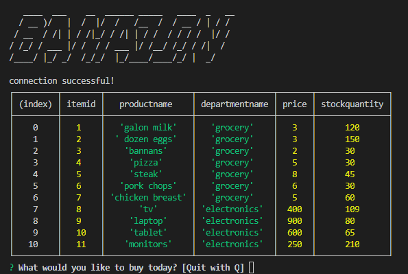
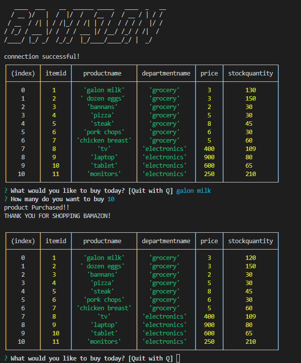
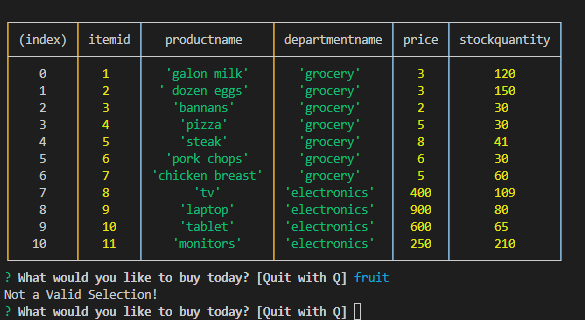
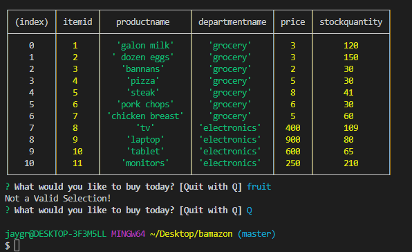

# Bamazon
Welcome to Bamazon.  A node terminal app that uses mysql tables.

Whenn you enter the site.  A table of items available to purchase is listed for the user.

When the user enters the name of the itme they wish to purchase it will then ask how many of that item you wish to purchase.
Once entered it will display thank you for shopping and will display a new table with a reduced quanity.
Example shows the purchase of 10 one gallon jugs of milk.  This reduces the quanity from 130 to 120.

The next example show that if you enter a selection that is not in the table it will display, "not a valid selection" and will prompt them to make a new selection.

The final example shows that if you wish to exit the app type "Q" and it will exit the prompt.
